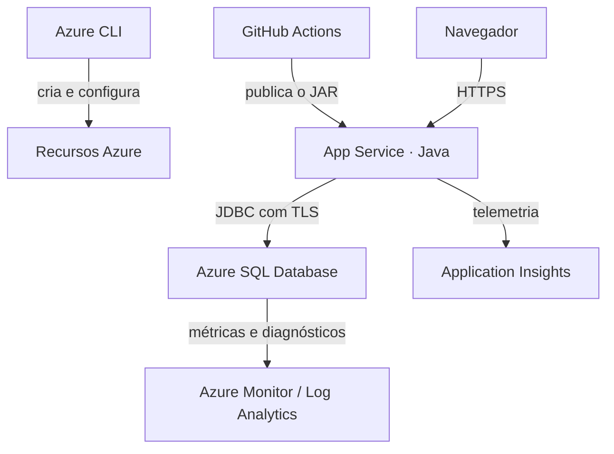

# DimDim — CP5 de Cloud

Professor, este é o projeto do checkpoint de Cloud. A aplicação permite cadastrar clientes e gerenciar as contas vinculadas a eles. A ideia foi usar esse fluxo para demonstrar o CRUD nas duas tabelas, a persistência no Azure SQL e o monitoramento da aplicação.

Usei Java 17 com Spring Boot, Azure CLI para criar os recursos e GitHub Actions para fazer o build e o deploy no App Service. O monitoramento ficou com o Application Insights e as métricas do Azure SQL.

## Como o projeto funciona

Depois do login, é possível cadastrar, consultar, editar e excluir clientes e contas pela interface.

Cada conta pertence a um cliente. Por isso, o sistema não permite excluir um cliente que ainda tenha contas vinculadas. Também há validação de e-mail e número de conta únicos, além do bloqueio de saldo negativo.

Os dados ficam nas tabelas `Clientes` e `Contas` do Azure SQL Database. A interface consulta a API, que acessa o banco com JdbcTemplate. Os registros não ficam salvos no navegador.

## Arquitetura



O deploy usa um **publish profile**, guardado nos Secrets do GitHub Actions. O script de OIDC continua na pasta `scripts` como alternativa, mas não faz parte do fluxo atual.

## Onde está cada parte

| Arquivo ou pasta | Conteúdo |
|---|---|
| `src/main` | Código da aplicação e interface |
| `src/test` | Testes da API |
| `scripts/01-provisionar.sh` | Criação e configuração dos recursos na Azure |
| `scripts/ddl.sql` | Criação das tabelas, chaves e relacionamento |
| `scripts/verificar-persistencia.sql` | Consultas para conferir os dados após o CRUD |
| `scripts/monitoramento.kql` | Consultas de monitoramento |
| `.github/workflows/deploy.yml` | Build, testes, deploy e health check |
| `docs/operacoes.http` e `docs/operacoes.json` | Exemplos das chamadas e dos dados enviados à API |
| `docs/roteiro-video.md` | Sequência da demonstração |

## Como executar na Azure

Os comandos abaixo são para Bash, inclusive no Azure Cloud Shell. Para reproduzir o projeto, é preciso ter uma assinatura com permissão para criar os recursos.

### 1. Baixar e configurar

```bash
git clone https://github.com/Nicomotac/dimdim-cloud-entrega.git
cd dimdim-cloud-entrega
cp .env.example .env
chmod 600 .env
```

Preencha o `.env` local com os dados do seu ambiente:

| Variável | Preenchimento |
|---|---|
| `AZ_SUBSCRIPTION_ID` | ID da assinatura |
| `PREFIX` | Prefixo exclusivo, com 4 a 16 letras minúsculas ou números, começando por letra |
| `LOCATION` | Região disponível na assinatura |
| `GITHUB_REPOSITORY` | Dono e nome do repositório |
| `GITHUB_BRANCH` | `main` |
| `APP_SERVICE_SKU` | `B1` |
| `SQL_SERVICE_OBJECTIVE` | `Basic` |

Os campos `SQL_ADMIN`, `SQL_PASSWORD`, `APP_USERNAME` e `APP_PASSWORD` também podem ser preenchidos no `.env`. Se ficarem vazios, o script solicita os valores com entrada oculta. A senha do SQL precisa atender às regras da Azure.

O `.env` fica fora do Git. O arquivo publicado é apenas o `.env.example`, sem credenciais. Use aspas simples nos valores e não coloque comandos no arquivo, pois ele é carregado pelo Bash. O formato antigo `scripts/config.local.sh` ainda funciona quando não existe um `.env`.

### 2. Criar os recursos

Fora do Cloud Shell, faça login com `az login`. Depois execute:

```bash
bash scripts/01-provisionar.sh
```

O script cria o grupo de recursos, plano do App Service, aplicação, servidor SQL, banco, Application Insights e Log Analytics. Também configura a conexão com o banco, o firewall SQL e os diagnósticos.

O plano B1, o banco Basic e a coleta de logs podem consumir créditos da assinatura.

### 3. Configurar o deploy

No repositório, acesse **Settings → Secrets and variables → Actions** e cadastre:

| Tipo | Nome | Valor |
|---|---|---|
| Variable | `AZURE_WEBAPP_NAME` | Nome do App Service |
| Secret | `AZURE_WEBAPP_PUBLISH_PROFILE` | Conteúdo completo do perfil de publicação do App Service |

O perfil de publicação contém credenciais e deve ficar somente no Secret. As senhas do banco e do aplicativo ficam nas configurações do App Service, preenchidas pelo script.

Com isso configurado, execute o workflow pela aba **Actions**. Ele compila o projeto, roda os testes, publica o `app.jar` e consulta `/actuator/health` para verificar a saúde da aplicação e da conexão SQL.

Build e deploy estão no mesmo job. Pushes na `main` disparam o fluxo; pull requests executam apenas o build e os testes.

### 4. Abrir o aplicativo

A URL segue o formato:

```text
https://app-SEU_PREFIX-cp5.azurewebsites.net
```

Entre com o usuário e a senha do aplicativo definidos no provisionamento. O login SQL é usado para acessar o banco, não para entrar na interface.

Na primeira inicialização, o Spring executa o DDL e cria as tabelas caso ainda não existam. Um novo deploy ou reinício não apaga os registros.

## CRUD e persistência

As duas entidades possuem os mesmos tipos de operação:

| Operação | Clientes | Contas |
|---|---|---|
| Criar | `POST /api/clientes` | `POST /api/contas` |
| Listar | `GET /api/clientes` | `GET /api/contas` |
| Consultar por ID | `GET /api/clientes/{id}` | `GET /api/contas/{id}` |
| Atualizar | `PUT /api/clientes/{id}` | `PUT /api/contas/{id}` |
| Excluir | `DELETE /api/clientes/{id}` | `DELETE /api/contas/{id}` |

Para conferir a persistência, abra o **Query editor** do banco `dimdim` e execute estas consultas depois de cada operação na interface:

```sql
SELECT DB_NAME() AS banco, SYSUTCDATETIME() AS instante_utc;

SELECT id, nome, email, criado_em
FROM dbo.Clientes
ORDER BY id;

SELECT id, cliente_id, numero, saldo, criado_em
FROM dbo.Contas
ORDER BY id;
```

A sequência é cadastrar um cliente, consultar e editar seus dados; depois cadastrar, consultar e editar uma conta vinculada a ele. Para excluir, remova primeiro a conta e depois o cliente.

Após cada inclusão ou edição, o SELECT permite conferir os valores gravados. Na consulta, os dados da tela devem corresponder aos do banco. Após a exclusão, o registro não deve mais aparecer.

Se o acesso ao banco estiver bloqueado pelo firewall, o script `scripts/03-liberar-ip-sql.sh` permite cadastrar o IP do computador usado na consulta.

## Monitoramento

No **Application Insights**, as telas de Requests, Performance e Dependencies permitem acompanhar as requisições da aplicação, o tempo de resposta e as chamadas ao SQL. As consultas usadas para essa análise estão em `scripts/monitoramento.kql`.

No **Azure SQL Database → Metrics**, é possível acompanhar CPU, DTU, sessões e armazenamento. Os diagnósticos também são enviados ao Log Analytics.

A coleta pode levar alguns minutos para aparecer depois das operações. Para consultar o monitoramento pelo terminal:

```bash
bash scripts/04-monitorar.sh
```

## Testes e execução local

Para compilar e rodar os testes:

```bash
mvn verify
```

Os testes da API usam o repositório simulado. A comprovação da persistência no Azure SQL é feita separadamente, executando o CRUD e os SELECTs no banco.

Para abrir a aplicação localmente, é necessário Java 17, Maven e acesso ao Azure SQL. Preencha `DB_URL`, `DB_USERNAME`, `DB_PASSWORD`, `APP_USERNAME` e `APP_PASSWORD` no `.env`. Depois, na raiz do projeto, execute em Bash:

```bash
set +x
set -a
source .env
set +a
mvn spring-boot:run
```

A aplicação abre em `http://localhost:8080`. O carregamento acima é necessário porque este projeto não lê o `.env` automaticamente pelo Spring.

## Encerramento dos recursos

Quando o ambiente não for mais necessário, o script abaixo solicita o nome do grupo antes de excluir seus recursos, incluindo o banco e os dados:

```bash
bash scripts/99-remover-recursos.sh
```

Se o ambiente já tiver sido removido, não é preciso recriá-lo para consultar o código ou atualizar a documentação.
