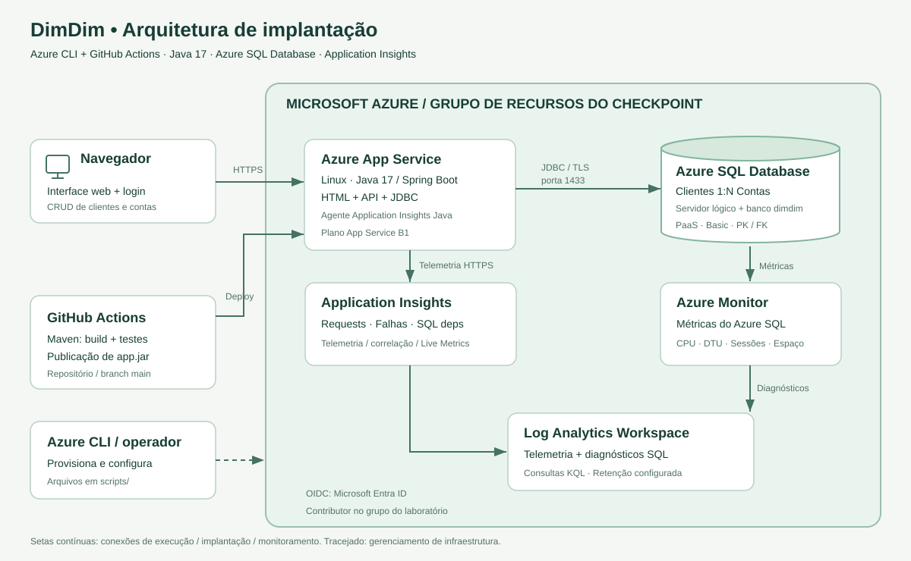

# DimDim Cloud — Checkpoint de Cloud

Aplicação web independente para gestão de clientes e contas, com interface em português, Java 17 / Spring Boot 3.5.16, persistência em **Azure SQL Database**, implantação por **GitHub Actions** e recursos criados com **Azure CLI**. O monitoramento do aplicativo usa **Application Insights**; o banco também possui métricas e diagnósticos no Azure Monitor / Log Analytics.

Este projeto foi criado para este checkpoint. Não reutiliza o projeto da Sprint 3. O recorte funcional adotado para DimDim é clientes e contas; confirme com o grupo se desejam outro recorte do estudo de caso.

**Link do aplicativo Azure:** app-dimdim561857-cp5.azurewebsites.net

**Integrantes:** CAIO KENZO - RM562979 / ENZO VIEIRA - 563000 / NICOLAS MOTA - RM 561857

## 1. O que está implementado

| Exigência | Implementação / evidência |
|---|---|
| Web app Java ou .NET | Java + interface HTML/CSS/JavaScript com login |
| Azure CLI + GitHub Actions | `scripts/01-provisionar.sh`, `02-configurar-oidc.sh` e `.github/workflows/deploy.yml` |
| Banco PaaS Azure SQL | Servidor lógico Azure SQL + database `dimdim`; sem container de banco |
| Duas tabelas relacionadas | `Clientes` 1:N `Contas`, FK `Contas.cliente_id` |
| CRUD em ambas | Interface e endpoints GET/POST/PUT/DELETE |
| DDL e CLI em scripts | `scripts/ddl.sql` e arquivos `.sh` |
| Monitoramento App Insights | Agente Java gerenciado no App Service Linux, requisições e dependências SQL |
| Monitoramento do banco | CPU, DTU, sessões, armazenamento e diagnósticos para Log Analytics |
| Persistência depois de cada operação | `scripts/verificar-persistencia.sql` e roteiro de vídeo pela interface |
| Arquitetura | `docs/arquitetura.svg` |
| Contratos HTTP/JSON | `docs/operacoes.http` e `docs/operacoes.json` |
| Vídeo e PDF | Devem ser finalizados com execução real, nomes/RMs e links do grupo |

## 2. Arquitetura



O navegador acessa o App Service por HTTPS. A interface chama a API Java no mesmo domínio. O JdbcTemplate usa o driver Microsoft SQL Server com TLS para persistir em Azure SQL Database. O banco é um serviço PaaS independente do App Service.

O GitHub Actions compila, executa os testes, autentica na Azure com OpenID Connect e publica o JAR no App Service. A identidade de deploy tem papel Contributor **somente no grupo de recursos deste laboratório**; não recebe esse papel na assinatura inteira. A identidade é confiada somente para `main` do repositório escolhido.

O agente Java do Application Insights coleta requisições, falhas e dependências JDBC. As métricas do banco vêm do Azure SQL/Azure Monitor; a configuração de diagnóstico as envia ao Log Analytics. **Uma dependência SQL no App Insights não substitui as métricas do banco nem o SELECT que comprova os dados.**

## 3. Pré-requisitos

- Conta GitHub e **um repositório novo**, separado da Sprint 3.
- Assinatura Azure ativa com permissão para criar recursos. Para OIDC, permissão de criar registro de aplicativo/service principal no Microsoft Entra e atribuir papéis no grupo. Se a conta acadêmica bloquear isso, o administrador precisa autorizar/configurar a identidade; não tente contornar a restrição.
- Git; Java 17 e Maven 3.9+ para compilar localmente. O GitHub Actions já instala o Java e fornece Maven.
- **Azure Cloud Shell no modo Bash** para os scripts Azure. WSL com Azure CLI também funciona. Os `.sh` não são comandos de PowerShell/CMD.
- Python 3 é utilizado internamente pelos scripts Azure CLI para montar configurações JSON e validar o IP. Está disponível no Azure Cloud Shell. A demonstração do CRUD é realizada pela interface + Query Editor, conforme seção 8; não exige instalar sqlcmd.


**Custos:** App Service B1, Azure SQL Basic e ingestão de logs podem gerar cobrança. Verifique a política/regiões/quota e o saldo da assinatura antes de executar. O nome da região é configurável; nenhuma região/SKU é garantida para toda assinatura. Não apague recursos antes da correção.

## 4. Publicar o código no GitHub

Extraia o ZIP e abra um terminal **dentro de `dimdim-cloud`**, onde está `pom.xml`. Crie no GitHub um repositório vazio chamado `dimdim-cloud`. Não inicialize o repositório remoto com README, pois este pacote já contém um.

Para esta pasta nova, sem histórico anterior:

```bash
git init -b main
git add .
git commit -m "feat: aplicação DimDim e infraestrutura do checkpoint"
git remote add origin https://github.com/SEU_USUARIO/dimdim-cloud.git
git push -u origin main
```

Não use `--force`, não exclua `.git` de projetos existentes e não sobrescreva a Sprint 3. A pasta `.github/workflows` precisa estar no GitHub. A primeira execução automática pode compilar e falhar no deploy enquanto as variáveis Azure ainda não existem; isso é esperado nessa ordem inicial. Reexecute o workflow depois da seção 6.

Se o repositório for privado, conceda acesso ao professor e valide o acesso ao vídeo. Nunca publique usuários/senhas/tokens de Azure, SQL ou aplicativo no README, workflow, vídeo ou código.

## 5. Criar recursos por Azure CLI

Abra [Azure Portal](https://portal.azure.com), inicie o Cloud Shell e selecione **Bash**. Clone seu repositório; para um repo privado, autentique o GitHub sem colocar token na URL ou no vídeo.

```bash
git clone https://github.com/SEU_USUARIO/dimdim-cloud.git
cd dimdim-cloud
az account list --query '[].{Assinatura:name,Id:id}' --output table
cp scripts/config.example.sh scripts/config.local.sh
code scripts/config.local.sh
```

Se o editor `code` não estiver disponível, use `nano scripts/config.local.sh`. Configure:

| Campo | O que informar |
|---|---|
| `AZ_SUBSCRIPTION_ID` | ID real da assinatura selecionada |
| `PREFIX` | De 4 a 16 letras minúsculas/números, iniciando com letra; use algo exclusivo como `dimdim` + RM |
| `LOCATION` | Região permitida para App Service, SQL, Log Analytics e App Insights |
| `GITHUB_REPOSITORY` | `SEU_USUARIO/dimdim-cloud`, com maiúsculas/minúsculas exatas |
| `GITHUB_BRANCH` | `main` |
| `APP_SERVICE_SKU` | `B1` por padrão |
| `SQL_SERVICE_OBJECTIVE` | `Basic` por padrão |

`config.local.sh` é ignorado pelo Git. Guarde seu prefixo e as credenciais em local seguro. No Cloud Shell a sessão geralmente já está autenticada. Fora dele, rode `az login`.

```bash
bash scripts/01-provisionar.sh
```

O script pede usuário/senha SQL e usuário/senha do aplicativo com entrada oculta. A senha do aplicativo precisa apenas estar preenchida: o script não exige mais 16 caracteres. Para o Azure SQL, a senha deve ter de 8 a 128 caracteres, conter ao menos três categorias entre maiúsculas, minúsculas, números e símbolos, e não conter o nome do administrador. A senha SQL `123` não é aceita pelo serviço. Informe as credenciais nos prompts; não grave senhas no código ou no repositório. O administrador SQL não deve se chamar `admin`, `sa`, `root` ou outro nome reservado. Não ative `set -x`/`--debug` nem exiba as configurações do app no vídeo.

O script cria:

1. Grupo `rg-PREFIX-cp5`.
2. Log Analytics e Application Insights conectados.
3. Servidor lógico `sql-PREFIX-cp5` e banco `dimdim`.
4. Plano Linux e App Service Java 17 `app-PREFIX-cp5`.
5. Firewall SQL para os possíveis IPs de saída do App Service.
6. Configurações de conexão/login/telemetria e diagnósticos SQL.

As senhas são enviadas às configurações do App Service sem aparecer no output dos comandos. O arquivo temporário usado pelo script é restrito e removido ao encerrar. A URL exibida só terá a aplicação após o deploy.

**Inicialização do banco:** `scripts/ddl.sql` é incluído no JAR pelo Maven e executado pelo Spring na inicialização. Cria as duas tabelas somente se ainda não existirem; não apaga dados em novo deploy/restart. Não utiliza H2, Oracle ou banco containerizado. Para alterações futuras de estrutura, use migrações versionadas; o DDL inicial não altera tabelas já existentes.

Para simplificar a primeira implantação acadêmica, a aplicação usa o login SQL criado no provisionamento, inclusive para o DDL. Em produção, separe o usuário de migração do usuário de runtime com permissões apenas de CRUD, além de adotar rede privada/identidade gerenciada conforme a arquitetura real. O laboratório contém apenas dados fictícios.

## 6. Configurar OIDC e executar o GitHub Actions

No mesmo terminal:

```bash
bash scripts/02-configurar-oidc.sh
```

O script cria/reutiliza um registro de aplicativo Entra exclusivo do laboratório, seu service principal, credencial federada da branch `main` e permissão Contributor no grupo. Não cria segredo de cliente. A conta que executa precisa das permissões descritas nos pré-requisitos.

Copie os quatro identificadores exibidos para **GitHub → repositório → Settings → Secrets and variables → Actions → Variables → New repository variable**:

| Variable | Origem |
|---|---|
| `AZURE_CLIENT_ID` | Saída do script 02 |
| `AZURE_TENANT_ID` | Saída do script 02 |
| `AZURE_SUBSCRIPTION_ID` | Saída do script 02 |
| `AZURE_WEBAPP_NAME` | Saída do script 02 |

O YAML usa `vars`, portanto cadastre em **Variables**, não em Secrets. Não adicione usuário/senha SQL ao GitHub. Eles já foram configurados no App Service. Também não é necessário publish profile.

No GitHub, vá a **Actions → Build, test and deploy DimDim → Run workflow → main**. Se o OIDC acabou de ser criado, a propagação de permissões pode levar alguns minutos; aguarde e reexecute caso receba erro de autorização transitório.

Mostre no vídeo as etapas reais:

1. Checkout e Java 17.
2. `mvn verify`: compilação e testes.
3. Upload/download do JAR `app.jar`.
4. Login Azure via OIDC.
5. `azure/webapps-deploy@v3` implantando no App Service.
6. Consulta HTTPS ao `/actuator/health` retornando `UP`, incluindo a saúde da conexão SQL.

O deploy ocorre por **GitHub Actions**. Azure CLI fica responsável pela infraestrutura/configuração. A execução em pull request apenas compila/testa; não publica.

## 7. Abrir a aplicação

Abra `https://app-SEU_PREFIX-cp5.azurewebsites.net` e faça login com as credenciais do aplicativo definidas no script 01. Não use as credenciais SQL no formulário de login.

Cadastre um cliente antes de uma conta. E-mails e números de conta são únicos. Saldo não pode ser negativo. Excluir cliente com conta vinculada retorna HTTP 409. Exclua a conta primeiro e depois o cliente.

As alterações são gravadas via JDBC no Azure SQL. O front-end não armazena clientes/contas em localStorage. Recarregar o navegador ou reiniciar o App Service preserva os registros no banco.

## 8. Provar cada CRUD diretamente no banco

### Demonstração manual, pela interface (faça no vídeo)

No Portal, abra **SQL databases → dimdim → Query editor** e autentique-se sem mostrar credenciais na gravação. Se houver bloqueio de IP, adicione o IP do cliente indicado pelo portal em Networking do servidor ou execute `bash scripts/03-liberar-ip-sql.sh`.

Abra lado a lado a aplicação publicada e o editor conectado ao banco `dimdim`. Em cada etapa execute o SELECT de `scripts/verificar-persistencia.sql`, ajustando os IDs reais:

| Ordem | Operação na interface | Comprovação imediata no Azure SQL |
|---|---|---|
| 1 | Criar cliente Ana CP5 | Linha inserida em `dbo.Clientes` |
| 2 | Consultar/listar cliente | Mesmo ID/nome/e-mail retornado no SELECT |
| 3 | Editar nome do cliente | Novo nome persistido no mesmo ID |
| 4 | Criar conta ligada ao cliente, saldo 100 | Linha em `dbo.Contas`; `cliente_id` correto |
| 5 | Consultar/listar conta | Número, saldo e JOIN com cliente conferem |
| 6 | Editar conta, saldo 250,50 | Novo saldo/número persistidos |
| 7 | Tentar excluir cliente com conta | Mensagem de conflito; cliente e conta continuam presentes |
| 8 | Excluir conta | SELECT pelo ID retorna **zero linhas** |
| 9 | Excluir cliente | SELECT pelo ID retorna **zero linhas** |

O READ não modifica registros: sua evidência é comparar o que a aplicação lê com o SELECT no banco. O DELETE comprova a remoção, não uma linha ainda existente. Não deixe todos os SELECTs para o fim: o professor exige comprovar **depois de cada operação**.

Antes de apagar os registros, recarregue a página e, se quiser demonstrar persistência entre reinícios, reinicie o App Service pelo portal e mostre que os dados continuam lá. Essa comprovação extra não substitui as oito operações de CRUD.

## 9. Mostrar o monitoramento do App e do banco

Gere as operações CRUD **após o deploy**. Abra Application Insights associado ao app e ajuste o período para a última hora. Telemetria tem atraso de ingestão; aguarde alguns minutos e atualize, sem substituir evidência real por tela vazia.

1. **Live Metrics:** tráfego enquanto você usa a interface.
2. **Performance / Requests:** GET, POST, PUT e DELETE com tempo de resposta e status.
3. **Application Map / Dependencies:** App Service/Java chamando Azure SQL.
4. **Failures:** se executar o teste de conflito, explique os HTTP 409 e 404 esperados; eles não significam indisponibilidade.
5. **Logs:** execute uma consulta por vez de `scripts/monitoramento.kql`, no escopo indicado nos comentários. Mostre `requests`, `dependencies` de tipo SQL e, se houver, a correlação `operation_Id`.
6. **Azure SQL Database → Monitoring → Metrics:** mostre CPU percentage, DTU percentage, Sessions percentage e Data space used percent/storage. Se houver dúvida sobre nomes disponíveis, use `az monitor metrics list-definitions --resource ID_DO_BANCO`.
7. **Log Analytics → Logs:** execute a consulta `AzureMetrics` do arquivo KQL. `requests/dependencies` são nomes no escopo Application Insights; no workspace os equivalentes são `AppRequests/AppDependencies`.

Também pode consultar por CLI:

```bash
bash scripts/04-monitorar.sh
```

O agente é ativado por `APPLICATIONINSIGHTS_CONNECTION_STRING` e `ApplicationInsightsAgent_EXTENSION_VERSION=~3`. Amostragem de 100% foi configurada para as poucas operações do laboratório. Não foi adicionado um segundo SDK/agente para evitar telemetria duplicada. Não espere que o App Insights mostre valores completos de todas as linhas: use SELECT para isso.

Os diagnósticos SQL estão configurados, mas certas categorias geram dados apenas quando há eventos correspondentes. Habilitar diagnósticos não equivale a ativar auditoria SQL. O requisito de monitorar o banco pode ser demonstrado com suas métricas reais, junto das dependências SQL no App Insights.

## 10. Vídeo e entrega

Siga `docs/roteiro-video.md`. Grave pelo menos em 720p, com explicação falada e texto legível. Inclua criação dos recursos, pipeline executando o deploy, aplicação em URL Azure, todas as consultas SQL do CRUD e monitoramento App/Banco com coletas reais.

Preencha o link do vídeo no início deste README e envie a atualização ao GitHub. O PDF final deve se chamar **`NOME_DO_GRUPO_webapp.pdf`** e conter somente nome do grupo, RM/nome dos integrantes, link do GitHub e link do vídeo. Use `docs/conteudo-pdf.md` como modelo. Os demais artefatos ficam no repositório. Só o representante envia o PDF ao Teams.

Antes de entregar, confirme que o professor abre repositório/vídeo e, se precisar acessar o app protegido, forneça o acesso por canal privado autorizado, nunca no código público. Mantenha os recursos funcionando até a avaliação.

## 11. Compilar/testar localmente e limites da validação

```bash
mvn -B -ntp verify
```

Os testes MVC isolam o repositório e verificam autenticação, CSRF, validação, contratos HTTP e tratamento de conflito. **Não são testes de persistência nem evidência de deploy.** A validação real de persistência deve ser realizada depois da implantação, usando a interface e consultas independentes no Query Editor do Azure SQL após cada operação, conforme a seção 8.

Para rodar localmente, seria necessário configurar `DB_URL`, `DB_USERNAME`, `DB_PASSWORD`, `APP_USERNAME`, `APP_PASSWORD` e liberar seu IP no Azure SQL. O aplicativo continua usando Azure SQL, mas **a entrega/vídeo não podem usar localhost**. Por isso o caminho principal deste tutorial é o deploy Azure.

## 12. Problemas comuns

| Sintoma | Verificação/correção |
|---|---|
| `RequestDisallowedByAzure`, quota ou região | Confira regiões/SKUs permitidos pela assinatura; ajuste config antes de provisionar |
| Nome global já usado | Escolha novo `PREFIX` antes de criar recursos; não altere no meio sem identificar o que já foi criado |
| `Invalid runtime` | Liste `az webapp list-runtimes --os linux` e confira o identificador Java 17 disponível |
| `Insufficient privileges` em Entra/RBAC | Solicite ao administrador a configuração/permissão necessária para OIDC |
| `AADSTS700213` ou no matching federated identity | Confira owner/repo, branch `main`, tenant/client ID e subject da federação |
| Workflow sem variáveis | Crie Repository Variables, não Secrets; nomes precisam coincidir com o YAML |
| 502/503 no app | Confira falha de inicialização, JAR, JDBC URL, login SQL, firewall e DDL; abra Log stream sem expor dados sensíveis |
| Login SQL falhou | Use o usuário SQL definido no script 01; não confunda com login do aplicativo |
| SQL timeout/firewall | Libere o IP indicado pelo Query Editor e os IPs de saída do App Service; mudança de plano/região pode mudar esses IPs |
| App Insights vazio | Faça tráfego, espere ingestão, confira componente/período/agente; reinicie após corrigir settings |
| KQL não encontra `requests` | Você está no workspace; use AppRequests ou abra Logs no componente App Insights |
| HTTP 403 no POST/PUT/DELETE | Sessão/token CSRF expirou ou foi omitido; atualize página ou obtenha `/api/csrf` mantendo cookies |
| Query Editor desconectou | Autentique novamente e confira IP/regra de firewall |
| Banco existe, tabelas não | O app ainda não iniciou com sucesso; confira DDL/startup ou execute `scripts/ddl.sql` no banco `dimdim` |

Reexecutar o script 01 com o mesmo prefixo e as mesmas credenciais permite retomar parte de uma criação interrompida, mas não é um mecanismo de migração ou redefinição de senhas. Para rotacionar credenciais de um servidor existente, use o procedimento Azure apropriado e atualize as configurações do App Service.

## 13. Encerrar depois da avaliação

```bash
bash scripts/99-remover-recursos.sh
```

O script exige digitar o nome exato do grupo e apaga também os dados do banco. Faça backup se necessário. O registro de aplicativo Entra não é apagado com o grupo: remova-o separadamente após confirmar que não está sendo usado. Até a correção, mantenha os recursos e acessos disponíveis.

## Referências oficiais

- [Deploy App Service com GitHub Actions e OIDC](https://learn.microsoft.com/en-us/azure/app-service/deploy-github-actions)
- [Credenciais federadas na Azure CLI](https://learn.microsoft.com/en-us/cli/azure/ad/app/federated-credential)
- [Application Insights no App Service](https://learn.microsoft.com/en-us/azure/azure-monitor/app/codeless-app-service?tabs=java)
- [Criar Application Insights baseado em workspace](https://learn.microsoft.com/en-us/azure/azure-monitor/app/create-workspace-resource)
- [Azure SQL pela CLI](https://learn.microsoft.com/en-us/cli/azure/sql/db)
- [Diagnostic settings](https://learn.microsoft.com/en-us/azure/azure-monitor/platform/diagnostic-settings)
- [Azure Monitor metrics CLI](https://learn.microsoft.com/en-us/cli/azure/monitor/metrics)
